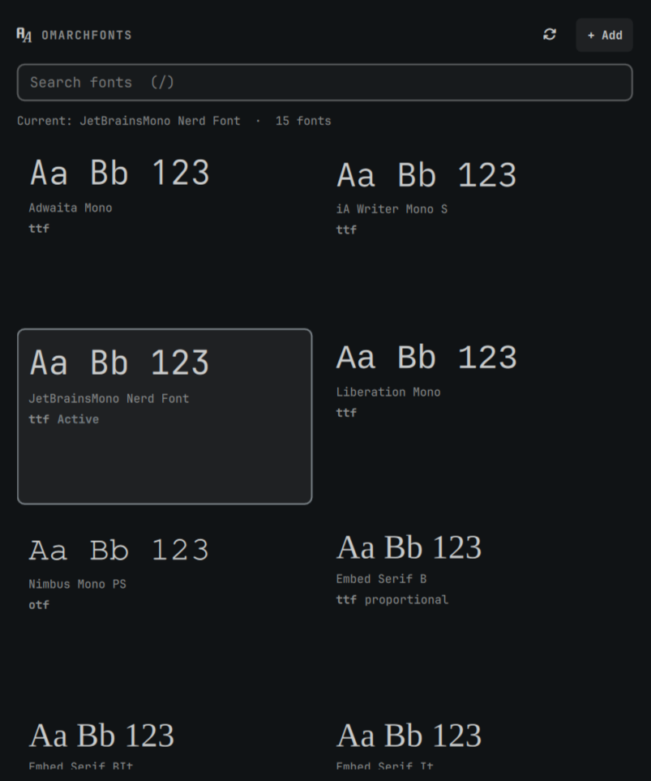

# OmarchFonts

Browse Omarchy fonts in a live preview grid, apply one with Activate, and install `.ttf` / `.otf` / `.zip` fonts into `~/.local/share/fonts` from the panel.

**Version:** 0.3.0

## Screenshot



## What it does

- **Grid preview** — monospace fonts from `omarchy font list`, plus user-installed faces from `~/.local/share/fonts`
- **Activate on hover** — small Activate button (bottom-right); Enter also applies the selection
- **Delete user fonts** — Delete button (bottom-left) on user-installed cards, with confirm; Delete key also works
- **Format labels** — shows `ttf` / `otf` / etc. on each card
- **Add fonts** — Zenity file picker copies into `~/.local/share/fonts`, refreshes `fc-cache`, notifies, optionally auto-applies the first monospace family
- **Search** — filter by family name (`/` focuses the search field)

## Install

```bash
omarchy plugin add https://github.com/giodc/OmarchFonts.git --enable
```

## Dependencies

These are expected on a normal Omarchy install:

| Dependency | Used for |
|------------|----------|
| Omarchy (`omarchy font list` / `current` / `set`) | Listing and applying the system monospace font |
| `fontconfig` (`fc-list`, `fc-query`, `fc-cache`) | Discovering families/formats and refreshing the cache |
| `zenity` | File picker when adding fonts from the panel |
| `unzip` | Extracting `.zip` font archives on install |

## Install (local / development)

```bash
mkdir -p ~/.config/omarchy/plugins
ln -sfn "$(pwd)" ~/.config/omarchy/plugins/io.github.giodc.omarchfonts
omarchy plugin enable io.github.giodc.omarchfonts
omarchy-shell shell rescanPlugins
```

## How fonts work on Omarchy

| Step | Command / path |
|------|----------------|
| List monospace fonts | `omarchy font list` |
| Show active font | `omarchy font current` |
| Apply | `omarchy font set "Family Name"` |
| User-installed files | `~/.local/share/fonts` + `fc-cache -f` |

## Settings

| Key | Default | Meaning |
|-----|---------|---------|
| `previewText` | `Aa Bb 123` | Sample string on each card |
| `autoApplyOnInstall` | `true` | After install, set the first monospace family automatically |

## Remove

```bash
omarchy plugin remove io.github.giodc.omarchfonts
```
